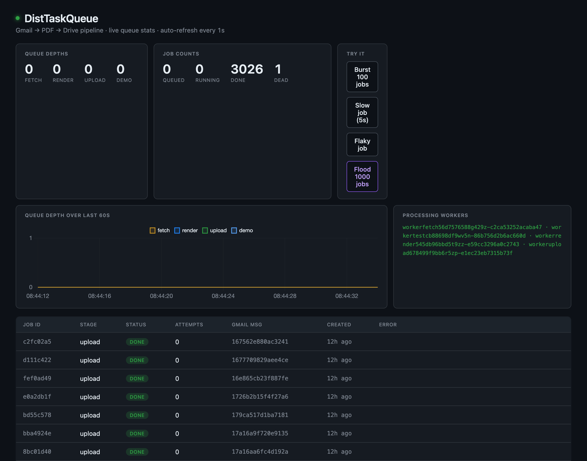

# DistTaskQueue

[](https://github.com/smallchungus/DistTaskQueue/actions/workflows/ci.yml)
[](https://github.com/smallchungus/DistTaskQueue/releases)
[](https://goreportcard.com/report/github.com/smallchungus/disttaskqueue)
[](LICENSE)

Self-hosted backup of your Gmail to your Google Drive. Every email is rendered to a PDF and filed into a dated Drive folder with its attachments, so your mail survives any single account. It runs on a hand-rolled distributed task queue in Go (raw Redis + Postgres, no queue library) — the kind of system you would normally reach for Celery or SQS to build.



**[Try the live dashboard](https://dtq.willchennn.com/)** — press Flood and watch 1,000 jobs drain while the workers autoscale. **[Run it yourself in 10 minutes](docs/SELF-HOSTING.md).**

## Status

Live in production on a Hetzner k3s cluster (~€8/mo). The full pipeline — Gmail History polling → MIME fetch → PDF render (Gotenberg) → Drive upload — runs end-to-end, with KEDA scaling each worker pool 1–5 on queue depth and the reliable-queue pop (BLMOVE into per-worker processing lists, acked after the DB settles, reclaimed by the sweeper when a worker dies).

Captured evidence: [a chaos run](docs/chaos-demo-sample.txt) — worker killed mid-job, recovered in 21 s — and [a flood chart](docs/loadtest/flood-run.png) — 1,000-job burst, replicas 1→5, drained in ~50 s.

Docs: [SELF-HOSTING.md](docs/SELF-HOSTING.md) (run it yourself), [ARCHITECTURE.md](docs/ARCHITECTURE.md) (what and why), [OPERATIONS.md](docs/OPERATIONS.md) (runbooks), [WAR-STORIES.md](docs/WAR-STORIES.md) (incidents and lessons).

## Quickstart

No clone required — two files:

```bash
curl -O https://raw.githubusercontent.com/smallchungus/DistTaskQueue/main/docker-compose.yaml
curl -o .env https://raw.githubusercontent.com/smallchungus/DistTaskQueue/main/.env.example
# edit .env: Google OAuth client id/secret, TOKEN_ENCRYPTION_KEY
docker compose up -d
```

See **[docs/SELF-HOSTING.md](docs/SELF-HOSTING.md)** for the full
walkthrough — Google Cloud OAuth setup, verifying the pipeline, backfilling
existing mail. About 10 minutes, most of it clicking through Google Cloud
Console.

For contributors hacking on the API/dashboard without the Gmail/Drive
pipeline: clone the repo and build from source with the
`docker-compose.build.yaml` override, no Google credentials or `.env`
needed — Compose brings up Postgres and Redis as `api`'s dependencies:

```bash
docker compose -f docker-compose.yaml -f docker-compose.build.yaml up --build api
curl localhost:8080/healthz
curl localhost:8080/version
docker compose down -v
```

`make docker-up` builds and starts the full nine-service stack (workers,
scheduler, sweeper, Gotenberg) from source — see
[SELF-HOSTING.md](docs/SELF-HOSTING.md) for running from the published
image instead.

Run the API directly without Docker:

```bash
make run
```

## Tests

```bash
make test-unit         # fast, no Docker
make test-integration  # spins up real Postgres + Redis via testcontainers-go
make lint              # golangci-lint
```

Integration tests use real Redis and real Postgres via [testcontainers-go](https://golang.testcontainers.org/) — never mocks. Mocking the queue and storage layers is how subtle bugs (race conditions, ordering, atomicity) escape into production.

## Load testing

```bash
make loadtest
```

Spins up real Postgres + Redis containers via testcontainers-go, enqueues 5000 no-op jobs, runs 4 workers as goroutines in parallel, and asserts the whole run completes under 15 seconds. Recent runs land around 2 seconds on a dev laptop.

Each job exercises the full path: insert into `pipeline_jobs`, `LPUSH` to a Redis stage list, `BLMOVE` into the worker's processing list, atomic claim via `UPDATE ... RETURNING`, then `MarkDone` and ack. Workers compete at Postgres and Redis, not in Go memory, so the in-process version stresses the same atomic primitives as a multi-process deployment.

## Git hooks

Optional but recommended. Install once after clone:

```bash
make install-hooks
```

- `pre-commit` — `gofmt`, `go vet`, `go test -short ./...`. Fast.
- `pre-push` — `golangci-lint`, full unit tests with `-race`.

Integration tests stay in CI only (they need Docker and are slow).

## Architecture

Deep walkthrough: **[docs/ARCHITECTURE.md](docs/ARCHITECTURE.md)** — why each component looks the way it does, what alternatives were considered and rejected, what correctness the system guarantees, where it scales and where it doesn't.

Operations / runbooks: **[docs/OPERATIONS.md](docs/OPERATIONS.md)** — cloud swap, scaling, OAuth bootstrap, disaster recovery.

War stories / incident writeups: **[docs/WAR-STORIES.md](docs/WAR-STORIES.md)** — the dead-token incident, the pop-to-claim window, the fix that nearly shipped a worse bug, and five more.

Three-stage pipeline: `fetch` → `render` → `upload`. Each stage is a Kubernetes Deployment with its own Redis queue, scaled 1–5 by KEDA on queue depth. Postgres holds pipeline state, status history, OAuth tokens, and idempotency keys. A sweeper requeues jobs from workers whose heartbeat expires (~15 s).

Prometheus metrics are exported at `GET /metrics` — queue depth per stage, job counts per status, live worker count — feeding the dashboard and the loadtest chart (KEDA polls Redis directly).

```
                              ┌──────────────┐
                              │   Browser    │
                              │  (dashboard) │
                              └──────┬───────┘
                                     │ HTTP via Traefik ingress
                                     ▼
                              ┌──────────────┐
       ┌─────────────────────▶│  API server  │◀── demo trigger buttons
       │                      │  Go, net/http│
       │                      └──────┬───────┘
       │     ┌───────────────────────┼───────────────────────┐
       │     ▼                       ▼                       ▼
       │  ┌──────┐               ┌────────┐              ┌──────────┐
       │  │Redis │  queues +     │Postgres│  pipeline    │ Local PV │
       │  │      │  heartbeats   │        │  state, OAuth│ (volume) │
       │  └──────┘               └────────┘              └──────────┘
       │     ▲     ▲     ▲          ▲                      ▲       ▲
       │ ┌───┴─┐ ┌─┴───┐ ┌─┴────┐ ┌─┴─┐                 ┌──┴──┐ ┌──┴──┐
       │ │FETCH│ │REND │ │UPLOAD│ │SWP│                 │FETCH│ │UPLD │
       │ │pool │ │pool │ │pool  │ │EEP│                 │write│ │read │
       │ └──┬──┘ └──┬──┘ └──┬───┘ └─┬─┘                 └─────┘ └─────┘
       │    │       │       │       │
       │    ▼       │       ▼       │
       │ ┌─────┐    │    ┌──────┐   │
       │ │Gmail│    │    │Drive │   │
       │ │ API │    │    │ API  │   │
       │ └─────┘    │    └──────┘   │
       │            ▼                │
       │      (renders PDF locally)  │
       │                             │
       └─────────── scheduler ───────┘
       (polls Gmail History every 60 s)
```

## Deploy

K8s manifests under `deploy/k8s/`. Validate offline:

```bash
make k8s-validate     # uses kubeconform — `brew install kubeconform`
```

Production is k3s on a single Hetzner cpx21 (3 vCPU / 4 GB, ~€8/mo), Traefik ingress on :80. Moving providers is a 20-minute runbook ([OPERATIONS.md §3](docs/OPERATIONS.md)) — it ran DigitalOcean → Hetzner for real. KEDA install + autoscaling: §13; loadtest + chart: §14.

## Repo layout

```
cmd/                 # api, worker (--stage flag), scheduler, sweeper, oauth-setup
internal/queue/      # Redis ops: BLMOVE pop, ack, reclaim, heartbeats
internal/store/      # hand-written SQL over pgx (pipeline_jobs, oauth, ...)
internal/worker/     # claim + settle + fail-stop loop shared by all stages
internal/sweeper/    # four recovery passes
internal/handler/    # fetch / render / upload stage logic
internal/gmail/ drive/ pdf/ oauth/ api/  # integrations + HTTP surface
internal/testutil/   # testcontainers helpers (integration build tag)
deploy/k8s/          # Kubernetes manifests incl. KEDA ScaledObjects
deploy/k8s-examples/ # example Secret shape (NOT applied)
scripts/             # chaos-demo, hpa-loadtest, plot, git hooks
docs/                # ARCHITECTURE, OPERATIONS, WAR-STORIES, artifacts
```

## Contributing

This is a solo portfolio project, but the conventions are real:

- TDD. Tests before implementation. Integration tests use real Postgres + Redis.
- Conventional commits (`feat:`, `fix:`, `chore:`, etc.) with optional component scope (`feat(api):`, `chore(k8s):`).
- One concern per PR.
- See [CLAUDE.md](CLAUDE.md) for the full project rules (the file is consumed by the AI assistant, but it's also the source of truth for human contributors).

## License

Apache License 2.0. See [LICENSE](LICENSE) for details.
